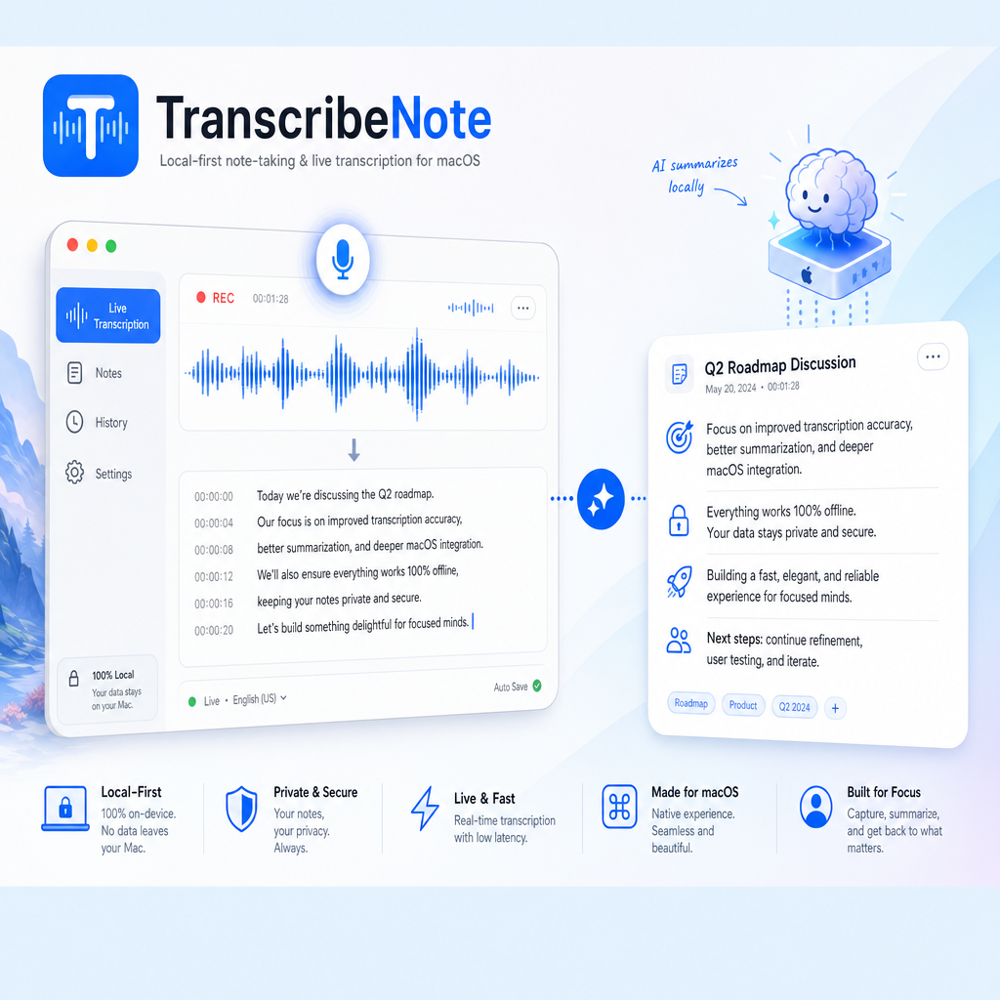

# TranscribeNote

A macOS note-taking and transcription app with live ASR, audio recording/playback, LLM-powered summarization, scheduled recordings, and session history — all local-first.

## Features

- **Live Transcription** — Real-time speech-to-text using Apple's SpeechAnalyzer (macOS 26+) with Voice Activity Detection
- **LLM Summarization** — Periodic and overall summaries via local or cloud LLMs (Ollama, OpenAI, Anthropic, LM Studio)
- **LLM Profile System** — Named model profiles assignable to roles (live summarization, overall summary, title generation)
- **Scheduled Recordings** — Timer-based and calendar-integrated scheduling with auto-start and duration limits
- **Multi-Clip Audio** — Pause/resume recording with automatic clip merging
- **Session Management** — Searchable, date-filterable session list with tagging support
- **Background Summaries** — Post-recording summarization independent of view lifecycle
- **Summary Editing** — Inline edit and guided regeneration of summaries
- **Privacy-First** — API keys in macOS Keychain, local LLM support, privacy disclosure UI
- **Crash Diagnostics** — MetricKit integration for previous-session crash reporting
- **Localization** — i18n support with language picker in settings

## Requirements

- macOS 26.2+
- Xcode (Swift 5, SwiftUI)
- Optional: local LLM server (Ollama, LM Studio) for summarization

## Build & Test

```bash
# Build
xcodebuild -scheme TranscribeNote -configuration Debug build

# Run fast unit tests (pure logic, no shared state)
xcodebuild -scheme TranscribeNote -testPlan UnitTests -configuration Debug test

# Run full test suite (all unit + UI tests)
xcodebuild -scheme TranscribeNote -testPlan FullTests -configuration Debug test

# Run a specific test suite
xcodebuild -scheme TranscribeNote -configuration Debug -only-testing:TranscribeNoteTests/RingBufferTests test

# Run UI tests
xcodebuild -scheme TranscribeNote -configuration Debug -only-testing:TranscribeNoteUITests test
```

> **Note:** Close the app before running tests — UI tests attach to running instances instead of launching fresh ones.

## Architecture

Three-layer architecture: **Views → ViewModels → Services**, with SwiftData `@Model` classes for persistence.

```
TranscribeNote/
├── notetakerApp.swift          # Entry point, ModelContainer, MenuBarExtra, Settings
├── ContentView.swift           # NavigationSplitView (sidebar + detail)
├── DesignSystem.swift          # DS enum (spacing, typography, colors, radius tokens)
├── Localizable.xcstrings       # Xcode String Catalog for i18n
├── Extensions/                 # ModelContext+SaveLogging, TimeInterval+Formatting
├── Models/                     # SwiftData models + config types
│   ├── RecordingSession        # Core session with segments, summaries, audio paths
│   ├── TranscriptSegment       # Timestamped speech segments
│   ├── SummaryBlock            # LLM-generated summaries (chunk + overall)
│   ├── ScheduledRecording      # Timed recording with repeat rules
│   ├── ActionItem              # Extracted action items from transcripts
│   ├── LLMConfig/Profile       # LLM connection config + named profiles
│   └── Schemas/                # V1–V8 migration plan
├── Services/                   # Protocol-based engines + utilities
│   ├── ASREngine               # Speech recognition protocol + SpeechAnalyzerEngine
│   ├── LLMEngine               # LLM protocol + Ollama/OpenAI/Anthropic/FoundationModels engines
│   ├── AudioCaptureService     # Recording with VAD gating
│   ├── AudioPlaybackService    # Playback with seek
│   ├── AudioExporter           # Multi-clip merge via AVComposition
│   ├── SummarizerService       # Prompt building + LLM orchestration
│   ├── BackgroundSummaryService # Post-recording summary generation
│   ├── ChatService             # Conversational transcript Q&A
│   ├── SchedulerService        # UNUserNotificationCenter scheduling
│   ├── CalendarService         # EventKit calendar import
│   ├── KeychainService         # Secure API key storage
│   └── CrashLogService         # MetricKit crash diagnostics
├── ViewModels/
│   ├── RecordingViewModel      # Central recording state machine
│   ├── SchedulerViewModel      # Scheduled recordings + calendar
│   └── ChatViewModel           # Chat panel state
└── Views/                      # SwiftUI views
    ├── SessionListView         # Grouped-by-day session browser
    ├── SessionDetailView       # Transcript + summaries + playback + chat
    ├── SettingsView            # Tabbed settings (General, Settings, Models, About)
    ├── ScheduleView            # Scheduled recording management
    └── ...                     # LiveRecordingView, TranscriptView, etc.

TranscribeNoteTests/            # ~66 test files, ~767 tests
TranscribeNoteUITests/          # UI tests (light/dark mode)
docs/                           # Privacy policy, App Store checklist, specs
scripts/                        # Build number increment
```

## Key Technical Details

- **Actor Isolation**: `SWIFT_DEFAULT_ACTOR_ISOLATION = MainActor` — audio/ASR/LLM classes use `nonisolated`
- **Thread Safety**: `OSAllocatedUnfairLock` for audio thread state, serial `DispatchQueue` for ASR engine
- **SwiftData Migration**: 8 schema versions (V1–V8) with lightweight migrations via `NotetakerMigrationPlan`
- **File Discovery**: `PBXFileSystemSynchronizedRootGroup` — no pbxproj edits needed for new source files
- **Audio Format**: M4A/AAC (128kbps) with automatic WAV fallback
- **Entitlements**: Sandbox + audio-input + user-selected files + network client + calendar access

## Default LLM Configuration

- Provider: `.apple` (Apple Foundation Model)
- Model: `foundation-small`
- Base URL: *(none required, uses on-device framework)*

## License

MIT
